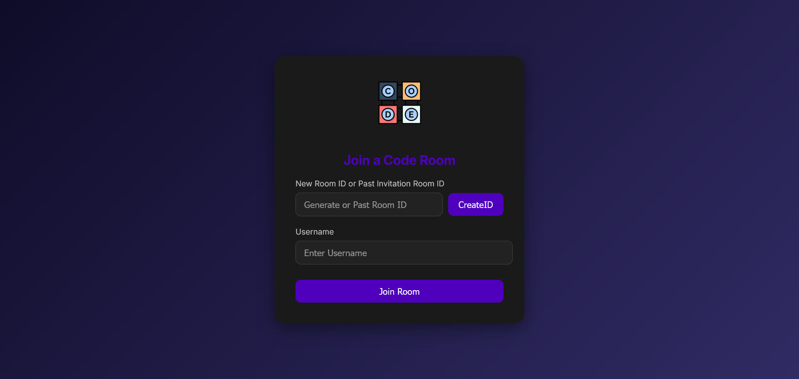
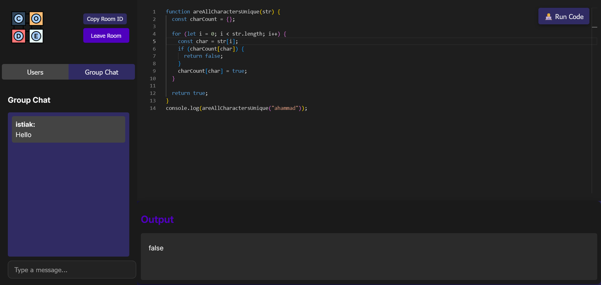

Based on your `package.json` file, here’s an updated **README** with relevant details, including the dependencies and scripts used for development and production.

---

# Real-Time Code Editor

A collaborative real-time code editor using **React**, **Monaco Editor**, **Socket.io**, and **Node.js**. This project enables multiple users to edit the same document simultaneously, with changes updated live.




## Features

- **Collaborative Editing**: Multiple users can work on the same document in real time.
- **Monaco Editor**: The same code editor that powers Visual Studio Code, providing a rich editing experience with syntax highlighting, autocompletion, and more.
- **User Authentication**: Join a session and collaborate by sharing a unique session ID.
- **Real-time Updates**: Powered by Socket.io for seamless and low-latency communication between users.
- **Responsive UI**: Built with **React** for smooth and efficient interaction.

## Tech Stack

- **Frontend**: React.js, Monaco Editor
- **Backend**: Node.js, Express.js, Socket.io
- **Build Tool**: Vite
- **Real-Time Communication**: Socket.io
- **Version Control**: Git, GitHub

## Installation

### Prerequisites

Make sure you have the following installed:

- **Node.js** (v14 or higher)
- **NPM** or **Yarn**

### Steps

1. Clone the repository:
   ```bash
   git clone https://github.com/mhistiak3/real-time-code-editor.git
   cd real-time-code-editor
   ```

2. Install dependencies:
   ```bash
   npm install
   ```

3. Start both the frontend and backend development servers:
   ```bash
   npm run dev
   ```

4. To run the backend server separately (with hot reloading for the backend):
   ```bash
   npm run server:dev
   ```

5. Open your browser and navigate to:
   ```
   http://localhost:5173/
   ```

### Build for Production

To build the frontend for production:

```bash
npm run build
```

To preview the production build locally:

```bash
npm run preview
```

## Scripts

- `npm run dev`: Starts the Vite development server.
- `npm run build`: Installs dependencies and builds the frontend.
- `npm run server:dev`: Starts the Node.js backend server with **Nodemon** for hot-reloading.
- `npm run start`: Starts the backend server without hot-reloading.
- `npm run preview`: Previews the built frontend using Vite.

## Dependencies

- **@monaco-editor/react**: Integration of Monaco editor into React for a powerful code-editing experience.
- **axios**: Promise-based HTTP client for making requests.
- **express**: Backend framework for handling routes and server logic.
- **lodash**: Utility library for easier manipulation of arrays, objects, etc.
- **react**, **react-dom**: React libraries for building the frontend.
- **react-router-dom**: Client-side routing for React.
- **react-hot-toast**: Notifications for the UI.
- **socket.io**: WebSocket library for real-time communication.
- **uuid**: Library for generating unique session IDs.

### Dev Dependencies

- **eslint**: Linting tool for maintaining code quality.
- **@vitejs/plugin-react**: Plugin for integrating React with Vite.
- **vite**: Fast build tool and development server.


## Usage

1. Open the app in your browser.
2. Share the Room ID with other collaborators.
3. Edit the code in real time and see updates across all connected users.

